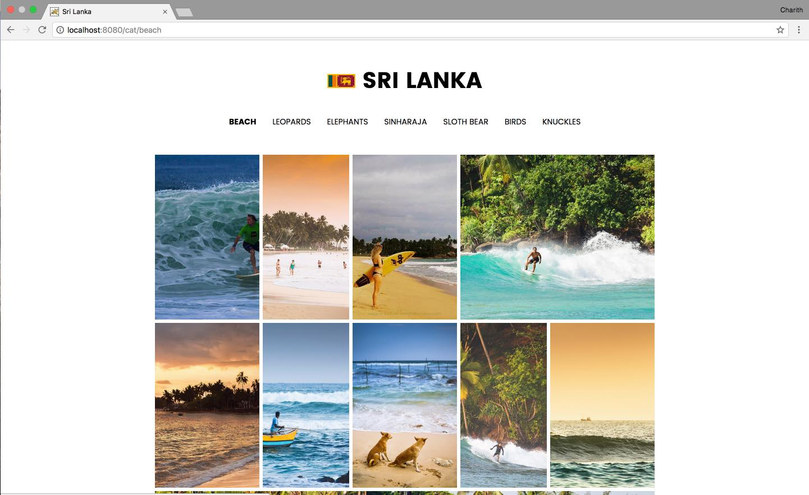

# ismorphic-vuejs-srilanka

> Captures of beautiful sri lanka . Built with Vue 2.0 + vue-router + vuex, axio ,flickr flicker api with server-side rendering [not yet implemented].




## Build Setup

``` bash
# install dependencies
npm install

# serve with hot reload at localhost:8080
npm run dev

# build for production with minification
npm run build

# build for production and view the bundle analyzer report
npm run build --report

# run unit tests
npm run unit

# run e2e tests
npm run e2e

# run all tests
npm test
```

##License

MIT

